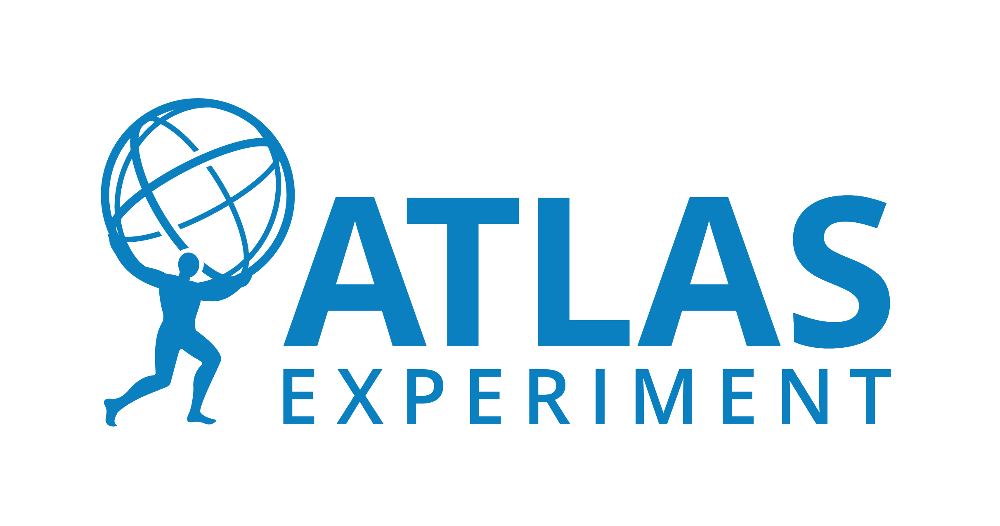

class: middle, center, title-slide
count: false

# Towards Differential Open Ecosystems

.huge.blue[Matthew Feickert] 
.huge[(University of Wisconsin-Madison)]
  
[matthew.feickert@cern.ch](mailto:matthew.feickert@cern.ch)

[UC Berkeley Vision/Chalk Talk](https://matthewfeickert-talks.github.io/talk-uc-berkeley-vision-talk-2024/)

January 30th, 2024

---
# Notes

* .bold[Time]: 45 minutes .bold[talk] + 5-10 minutes .bold[questions]
* .bold[Prompt]: For your vision/chalk talk, the committee asks that in addition to addressing your future research plans, we ask that you include in your 45 minute talk a 10 minute overview of your thoughts and efforts in DEIB, including: your understanding of diversity and the current state of diversity in your field, specific activities for improving DEIB that you may have been previously involved in, and specific plans for improving DEIB in the future.

 For the faculty only vision talk, feel free to bring a set of slides to set the stage for the discussion and provide any necessary background, as well as material you might expect to use as backup for illustration during. But after the initial setup of your research vision and ideas, you should expect a free-flowing discussion where prepared slides will be of less help.

---
# Introduction

.kol-2-3[
.huge[
* As a "data physicist" have privileged opportunity to work among multiple scientific communities
* Invested in .bold[reusable] open science to be able to push the physical sciences forward at the .bold[community scale]
   <!-- - The challenges of the next decade provide wonderful research environments that will require interdisciplinary knowledge exchange to fully attack -->
* My research vision is focused on .bold[engaging] the scientific open source communities to drive research and exploring .bold[applications] in the physical sciences (eye towards particle physics) that can have significant impact
]
]
.kol-1-3[
.center.width-65[]

.center.width-40[]

.center.width-40[]

.center.width-30[]

.center.width-90[]
]

---
# High Energy Physics at the LHC

.kol-1-2.center[

   

.caption[LHC]
]
.kol-1-2.center[

   

.caption[ATLAS]
]
.kol-1-1[
.kol-1-2.center[

   

]
.kol-1-2.center[
.kol-1-2.center[

   

]
.kol-1-2.center[

   

]
]
]

---
# High Energy Physics at the LHC

* Explain what it means to be part of the ATLAS collaboration
* Explain how publication works
* Explain how publication can take multiple years

---
# IRIS-HEP

.kol-3-5[

   

.large[
* LHC experiments as stakeholders
* LHC operations as partners
]
]
.kol-2-5[
 

   

.caption[Institute for Research and Innovation in Software for High Energy Physics (IRIS-HEP)

supported by the National Science Foundation Cooperative Agreements [OAC-1836650](https://www.nsf.gov/awardsearch/showAward?AWD_ID=1836650)  and [PHY-2323298](https://www.nsf.gov/awardsearch/showAward?AWD_ID=2323298)
]
]

---
# Opportunities and Challenges of the HL-LHC
<!--  -->

   
   

<!--  -->
.large[
* Increase in data generating collision rate ("luminosity") of roughly order of magnitude
   - Factor of .bold[20-25] times ($3$ - $4$ $\mathrm{ab}^{-1}$) the amount of collisions delivered from Run-2 of the LHC
* Boon for measurements constrained by statistical uncertainties, searches for rare processes
]

---
# Dedicated investment for the next decades

.bold.center.large[Exciting future for all these areas in particle physics with large scale investment!]

.kol-1-3[

   

.center[[Exploring the Quantum Universe 
Report of the 2023 Particle Physics Project Prioritization Panel](https://www.usparticlephysics.org/2023-p5-report/)]

.large[Once a decade formal recommendations from US particle physics community to .bold[US Congress and funding agencies]]
]
.kol-2-3[

   

   

   

]

<!-- * your understanding of diversity and the current state of diversity in your field
   - Diversity is not just gender or race
   - Diversity is about lived experience and thought
   - Diversity in physics is not great, but improving
* specific activities for improving DEIB that you may have been previously involved in
   - Workshops all have captioning
      - Check on PyHEP 2023
* specific plans for improving DEIB in the future
   - Making access to materials as open and accessible as possible (think specifically of teaching)
   - Code of Conduct for lab
   - Mentoring program
   - Engaging with AIMS Africa
   - Credit for work -->

---
# Diversity, Equity, Inclusion, and Belonging (DEIB)

.center[DEIB is something that permeates all of our work, so I want to address this first]

 
.kol-1-4[

   

.center[DEIB extends beyond what we see to who people are]
]
.kol-2-4[
 
 

   

 
.center[Better language accessibility helps everyone]
]
.kol-1-4[
 
 

   

.center[Establishing what we as a community do provides platforms for support]
]

---
# Research Program Pillars

.kol-1-3[

      

.center.large[Advancing data science for the physical sciences through open source]
]
.kol-1-3[
 

      

.center.large[Differentiable programming for current and future fundamental science]
]
.kol-1-3[

      

 

      

.center.large[Reusable open source cyberinfrastructure as tools for new science]
]

---
# Data Science for the physical sciences

.kol-1-3[

      

.center.large[Domain specific ecosystems are growing, but are at different maturity levels]
]
.kol-1-3[
 
.grid[
.kol-1-2[

      

]
.kol-1-2[
 

      

]
]
 
.center.large[Advancing data science requires spanning languages and open source communities]
]
.kol-1-3[

   
   

.center.large[Cultivating ecosystems of impact at the University, national, and international levels]
]

---
class: end-slide, center

.large[Backup]

---
# Opportunities and Challenges of the HL-LHC

.center.large[Challenge to be able to .bold[record, store, and analyze] the data]

   
.center[[ATLAS software and computing review](https://cds.cern.ch/record/2803119?ln=en)]

.center.large[Projected .bold[required compute usage] for HL-LHC (want .blue[R]&.red[D] below .black[budget] line)]

---
# High Energy Physics at the LHC

.kol-3-5[
.large[
* LHC beam crossing at experiments every .bold[25 ns]  (.bold[40 MHz] collisions)
   - Would translate to ~ petabyte per second ⚠️
   - Use real time data processing ("trigger") system to only keep potentially interesting collisions
   - Use further physics specific offline selections to reduce data stream even more
* Translates to roughly .bold[90 petabytes] of collision data recorded per year
<!-- * LHC Run 2 produced data set 5x that used for the 2012 Higgs discovery -->
* LHC data taking scheduled to continue for another roughly .bold[20 years]
   - Majority of data is yet to come!
]
]
.kol-2-5[

   
.center[Planned (HL-)LHC lifetime data collection]

]

---
# Opportunities and Challenges of the HL-LHC
<!--  -->

   

<!--  -->
.large[
* Increase in data generating collision rate ("luminosity") of roughly order of magnitude
   - Factor of .bold[20-25] times ($3$ - $4$ $\mathrm{ab}^{-1}$) the amount of collisions delivered from Run-2 of the LHC
* Boon for measurements constrained by statistical uncertainties, searches for rare processes
]

---

class: end-slide, center
count: false

The end.
