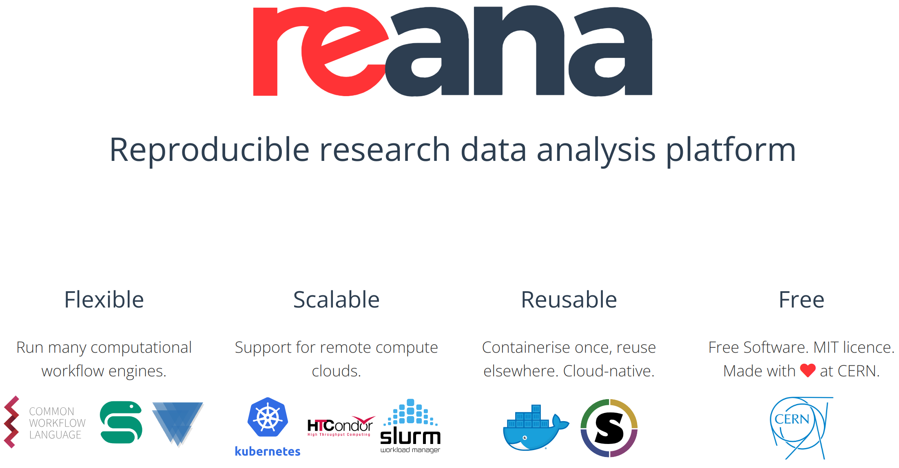

class: middle, center, title-slide
count: false

# Reusable Open Science as Tools for Discovery

.huge.blue[Matthew Feickert] 
.huge[(University of Wisconsin-Madison)]
  
[matthew.feickert@cern.ch](mailto:matthew.feickert@cern.ch)

[UC Berkeley Vision/Chalk Talk](https://matthewfeickert-talks.github.io/talk-uc-berkeley-vision-talk-2024/)

January 30th, 2024

---
# Notes

* .bold[Time]: 45 minutes .bold[talk] + 5-10 minutes .bold[questions]
* .bold[Prompt]: For your vision/chalk talk, the committee asks that in addition to addressing your future research plans, we ask that you include in your 45 minute talk a 10 minute overview of your thoughts and efforts in DEIB, including: your understanding of diversity and the current state of diversity in your field, specific activities for improving DEIB that you may have been previously involved in, and specific plans for improving DEIB in the future.

 For the faculty only vision talk, feel free to bring a set of slides to set the stage for the discussion and provide any necessary background, as well as material you might expect to use as backup for illustration during. But after the initial setup of your research vision and ideas, you should expect a free-flowing discussion where prepared slides will be of less help.

* .bold[Notes]: The slides following the DEIB slide are meant only for "backup for illustration during"

<!--
I'm an experimental high energy physicist but I also work on scientific software, data analysis tooling, and software community
building. These things historically don't map nicely to cultural expectations of what experimental particle physicists do, so there
has started to be a new ambagious term of "data physicist" that has come up to cover people like me.

My work has started out in the ATLAS experiment at the LHC where I have worked on searches for new physics, but as a researcher and
executive board member in IRIS-HEP I've also been able to focus on leading efforts to bring performant software and cyberinfrastucture
into the future for the next generation of particle physics experiments at the upgraded High Luminosity LHC (HL-LHC).

I've been able to expand my work through software research and tooling projects for Pythonic data analysis in the Scikit-HEP community project,
and help promote the value of scientific software by publishing and serving as an associate editor for JOSS.

A thread throughout my work is building scientific open source projects and communities that focus on reuse to move the physical sciences forward at the community scale.
-->

---
# Introduction

.kol-2-3[
.huge[
* As a "data physicist" have privileged opportunity to work among multiple scientific communities
* Invested in .bold[reusable] open science to push the physical sciences forward at the .bold[community scale]
   <!-- - The challenges of the next decade provide wonderful research environments that will require interdisciplinary knowledge exchange to fully attack -->
* My research vision is focused on .bold[engaging scientific open source communities] to drive research and exploring .bold[impactful data science applications in the physical sciences] (e.g. particle physics)
]
]
.kol-1-3[
.center.width-65[]

.center.width-40[]

.center.width-40[]

.center.width-30[]

.center.width-90[]
]

<!--
* Explain what it means to be part of the ATLAS collaboration
* Explain how publication works
* Explain how publication can take multiple years

A very brief, very high level overview of experimental high energy particle physics at the Large Hadron Collider.
The LHC is a 27 km circumference particle accelerator and collider system that is about 100 m underground in the Swiss/French
countryside outside of Geneva, Switzerland, where we accelerate beams of billions of protons to nearly the speed of light
to reach the highest energy densities on Earth before colliding them to probe the interactions between the fundamental forces
of Nature and matter.

I'm a member of the ATLAS experimental collaboration, where I'm one of approximately 3,000 collaboration members.
The ATLAS experiment seen on the right hand side is one of four primary particle physics detectors at the LHC, and we
use it and its expertly calibrated detector subsystems to track and record the energy and momentum of what comes out of
these proton-proton collisions.
We can then perform analysis on our data to see if our existing Standard Model of particle physics describes the data well, or if models
of new physics that extend Beyond the Standard Model are better fits.

As large experimental collaborations, which function more similarly to governments, physics analyses move slower than
some other fields of the physical sciences. Analyses will wait until the entire data taking period is finished (usually 2-3 years)
to perform the final analysis and this means that the time between publications for analysis can sometime take multiple years.
 -->

---
# High Energy Physics at the LHC

.kol-1-2.center[

   

.caption[LHC]
]
.kol-1-2.center[

   

.caption[ATLAS]
]
.kol-1-1[
.kol-1-2.center[

   

]
.kol-1-2.center[
.kol-1-2.center[

   

]
.kol-1-2.center[

   

]
]
]

<!--
-->

---
# Software in High Energy Physics

   

.large[
* Scientific software has a long history in HEP with high importance, often developing own tools that are highly tailored to its own problems (e.g. [MINUIT optimizer](https://cds.cern.ch/record/2296388/) (1970s))
* HEP has not been very good about (usefully) open sourcing code, being invested in broader scientific community software, or giving scholarly credit for software development
* With recent investments this has started to change
   - Establishing member of Scikit-HEP
<!-- Fernando spoke at SciPy 2003 on IPython first? -->
   - First HEP person (outside of Fernando Pérez) to be part of SciPy conference
]

<!--
* We're now well into the third data taking run of the LHC and the next big challenge is the High-Luminosity LHC (HL-LHC)
era where the "luminosity" of the accelerator --- I'm not going to take the time to summarize why it is "luminosity" but we can correlate
this to the rate at which the data generating collisions will happen --- will increase by about an order of magnitude.

To help put this into perspective, the ATLAS experiment records about 90 petabytes of data a year, and while most of the collisions are
uninteresting ones that don't get recorded and into the data, the amount of data being recorded in the HL-LHC era is going to significantly rise.

To help put this into a time perspective, the HL-LHC era will start in the late 2020s and will continue for the remainder of the LHC physics program --- another 20 years. This means that in the first 1/3 of the LHC program, we have only recorded about 10% of the total lifetime of the data of the LHC experiments, and in the remaining 2/3 will have to be ready to take 10x that much data.
-->

---
# Opportunities and Challenges of the HL-LHC
<!--  -->

   
   

<!--  -->
.large[
* Increase in data generating collision rate ("luminosity") of roughly order of magnitude
   - Factor of .bold[20-25] times the amount of collisions delivered from Run-2 of the LHC
   - .italic[Current] luminosity results in about .bold[90 petabytes] of collision data recorded per year
* Boon for measurements constrained by statistical uncertainties, searches for rare processes
]

---
# IRIS-HEP

.large[.bold[Execute R&D activities] required to close the HL-LHC software and computing gaps and serve as .bold[intellectual hub for larger community]]

.kol-3-5[
.huge.bold[[HL-LHC Software and Computing Gaps](https://inspirehep.net/literature/2628983)]
.huge[
1. Raw resource gaps

2. Scalability of the distributed computing cyberinfrastructure

3. Analysis at scale

4. Sustainability
]
]
.kol-2-5[

   

.center.large[Institute for Research and Innovation in Software for High Energy Physics (IRIS-HEP)]

.center[$50M in funding from the National Science Foundation Cooperative Agreements  [OAC-1836650](https://www.nsf.gov/awardsearch/showAward?AWD_ID=1836650) and [PHY-2323298](https://www.nsf.gov/awardsearch/showAward?AWD_ID=2323298)
]
]

---
# Dedicated investment for the next decades

.bold.center.large[Exciting future for all these areas in particle physics with large scale investment!]

.kol-1-3[

   

.center[[Report of the 2023 Particle Physics Project Prioritization Panel](https://www.usparticlephysics.org/2023-p5-report/)]

Once a decade formal recommendations from US particle physics community to .bold[US Congress and funding agencies]

Serve on Formation Task Force for the Coordinating Panel for Software and Computing
]
.kol-2-3[

   

   

   

]

<!--
## your understanding of diversity and the current state of diversity in your field

* I come from experimental high energy particle physics, a very international field.
The experimental collaborations are huge (ATLAS and CMS are about 3,000 authors each)
but we've historically not done the best when it comes to DEIB issues like gender representation.
While there has been impacts in the field over the last decade, with the number of women climbing,
we're still far from gender parity, and if this is broken down by regions this isn't homogenous growth.
I've learned though that DEIB isn't only about the diversity issues that we can see, but also about
ensuring equitable access and support. An under represented group of physicists that I've had the great
fortune to work with are member of the Deaf community, and I think they often go overlooked in broader
DEIB efforts. In the era of video calls, we often make lots of assumptions about how people can meet and
how quickly meetings can shift. While video calls are great for making things more public, if they
don't have high quality captions of the audio they aren't accessible to the Deaf community.
As the Deaf community is not always as publicly represented, they often need to advocate for their own
needs and resources, which is an additional time, energy, and labor debt when they might already
be lacking basic support structures.

## specific activities for improving DEIB that you may have been previously involved in

* Given my leadership roles in IRIS-HEP and the High Energy Physics Software Foundation I've secured funding
to ensure that all of the Python in HEP (PyHEP) workshops have public video recordings with professionally done
captioning. While ths work has been done primarily for the benefit of our deaf colleagues, this also benefits everyone
by making the videos more accessible and helping people for who English is not their primary language. We hear back on this!
It is important that the captioning is actually useful, and not just spending money to look like we're doing something.
For the captions to be useful, they have to be accurate. While there has been substantial improvement in transcription
and language over the last years, in our community studies we've found it (so far!) to not be an appropriate tools for
accessible captions. The high technical jargon, international accents and speech patterns of the community, and tendency
to favor male voices means that the word error rate was high enough that there would be an error more than every 2 seconds
on average.
* I've also made sure to interact with my deaf colleagues to ensure that the resources that we're providing them
are the right ones that they need and want, and worked to make sure that their feedback has been heard, shared, and
incorporated into the future.
* While small, I also ensure that all workshops and meetings that I organize have Codes of Conduct that are a required
box to check at registration, made clear in informational emails, and presented in the introductory slides.

## specific plans for improving DEIB in the future

* Making access to materials as open and accessible as possible (think specifically of teaching)
   - Captioning
   - screen reader accessibility
   - all materials being open access
   - I feel that the University of California system already does a good job of this, but I want to
     ensure that my classes and professional meetings set a high bar.
* Code of Conduct for lab
   - Codes of Conduct do not fix everything and a necessary part of having them is making sure they are
     actually enforced, which is hard to do right and something that NumFOCUS is looking into improving.
     What Codes of Conduct can help with though is making sure that people remember they are in a professional
     environment, and offering clear pathways for conflict resolution.
* Mentoring program
   - Providing mentorship to students to help them find the work and communities that they excel at is nontrivial,
     but an important responsibility.
* Engaging with AIMS Africa
* Credit for work
   - If people don't get credit for their work then URGs are going to be disincentivized from making
     efforts in software. By giving people due credit for their work and making sure that software
     is elevated as part of the intellectual work of science, this increases the equity of the work.
-->

---
# Diversity, Equity, Inclusion, and Belonging (DEIB)

.center.large[DEIB is something that permeates all of our work, so I want to address this first]

 
.kol-1-4[

   

.center[DEIB extends beyond what we see to who people are]
]
.kol-2-4[
 

   

 
 
.center[Better language accessibility helps everyone]
]
.kol-1-4[
 

   

 
.center[Establishing what we as a community do provides platforms for support]
]

<!--
My proposed research program focuses on
-->

---
# Research Program Pillars

.kol-1-3[

      

.center.large[Advancing data science for the physical sciences through open source]
]
.kol-1-3[
 

   

.center.large[Differentiable programming for current and future fundamental science]
]
.kol-1-3[

      

 

      

.center.large[Reusable open source cyberinfrastructure as tools for new science]
]

---
# Data Science for the physical sciences

.kol-1-3[

      

.center.large[Domain specific ecosystems are growing, but are at different maturity levels.  Build the bridges!]
]
.kol-1-3[
 
.grid[
.kol-1-2[

   

]
.kol-1-2[
 

      

]
]
 
.center.large[Advancing data science requires spanning languages and open source communities]
]
.kol-1-3[

   
   

.center.large[Cultivating ecosystems of impact at the University, national, and international levels]
]

---
# Diff. programming for fundamental science

.kol-1-3[

   

.center.large[Expanding automatic differentiation in physics analysis. Expand to add fixed point optimization.]
]
.kol-2-3[
$$
p\left(x \middle|\theta\right) = \int dz\_{D} dz\_{S} dz\_{P} \\, p\left(x \middle|z\_{D}\right) p\left(z\_{D} \middle|z\_{S}\right) p\left(z\_{S} \middle|z\_{P}\right) p\left(z\_{P} \middle|\theta\right)
$$

   

.center.large[Differentiable simulators can make simulation based inference less "black box" and be accessible to inference workflow]
]

---
# Cyberinfrastructure for reusable science

 
 
.kol-1-3[

   

.center.large[IRIS-HEP Analysis Systems tools as deployable scalable analysis workflow pipeline]
]
.kol-1-3[

   

 
.center.large[Analysis reinterpretation and full preservation with RECAST turning analyses into reusable scientific tools. Shrinking the experiment-theory feedback loop.]
]
.kol-1-3[

   

.center.large[Bringing analysis reuse to the cloud scale allows attacking previously intractable problems. Allows for methods like active learning in ML to become reasonable.]
]

---
# Summary

.huge[
* Open science brings opportunities for advancements across ecosystems, communities, and fields
* Identified areas prime for impact from my leadership in particle physics (analysis, scientific open source, communities)
* Excited to explore these areas more broadly across data science and cyberinfrastructure for the physical sciences
   - Shared techniques and methods
   - Shared technology ecosystems
   - Shared cyberinfrastrucutre broader goals
]

---
class: end-slide, center

.large[Backup]

---
# Opportunities and Challenges of the HL-LHC

.center.large[Challenge to be able to .bold[record, store, and analyze] the data]

   
.center[[ATLAS software and computing review](https://cds.cern.ch/record/2802918)]

.center.large[Projected .bold[required compute usage] for HL-LHC (want .blue[R]&.red[D] below .black[budget] line)]

---
# High Energy Physics at the LHC

.kol-3-5[
.large[
* LHC beam crossing at experiments every .bold[25 ns]  (.bold[40 MHz] collisions)
   - Would translate to ~ petabyte per second ⚠️
   - Use real time data processing ("trigger") system to only keep potentially interesting collisions
   - Use further physics specific offline selections to reduce data stream even more
* Translates to roughly .bold[90 petabytes] of collision data recorded per year
<!-- * LHC Run 2 produced data set 5x that used for the 2012 Higgs discovery -->
* LHC data taking scheduled to continue for another roughly .bold[20 years]
   - Majority of data is yet to come!
]
]
.kol-2-5[

   
.center[Planned (HL-)LHC lifetime data collection]

]

---
# Opportunities and Challenges of the HL-LHC
<!--  -->

   

<!--  -->
.large[
* Increase in data generating collision rate ("luminosity") of roughly order of magnitude
   - Factor of .bold[20-25] times ($3$ - $4$ $\mathrm{ab}^{-1}$) the amount of collisions delivered from Run-2 of the LHC
* Boon for measurements constrained by statistical uncertainties, searches for rare processes
]

---

class: end-slide, center
count: false

The end.
