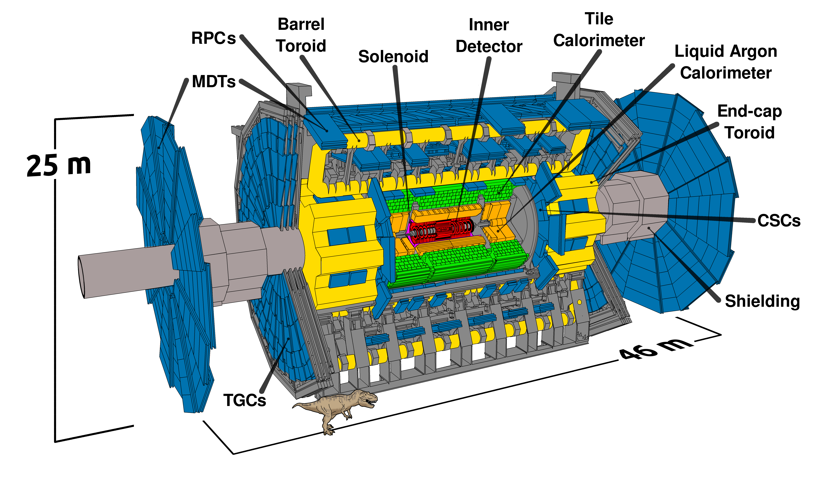
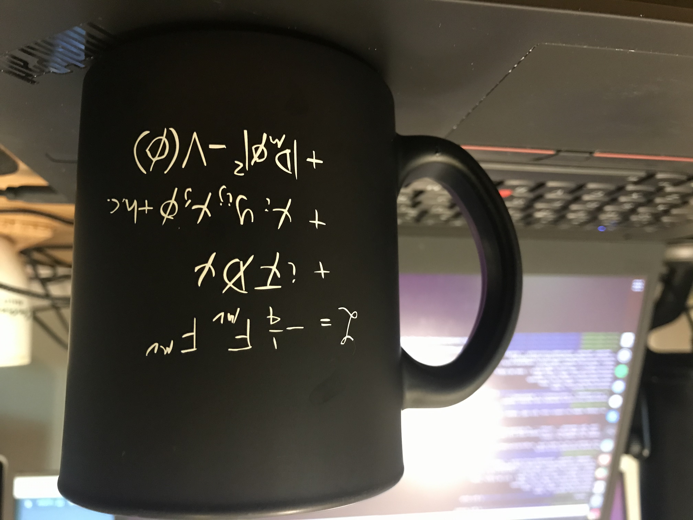

class: middle, center, title-slide
count: false

# Research Program Vision

.huge.blue[Matthew Feickert] 
.huge[(University of Wisconsin-Madison)]
  
[matthew.feickert@cern.ch](mailto:matthew.feickert@cern.ch)

[UC Berkeley Vision/Chalk Talk](https://matthewfeickert-talks.github.io/talk-uc-berkeley-vision-talk-2024/)

January 31st, 2024

---
# Notes

* .bold[Time]: 45 minutes .bold[talk] + 5-10 minutes .bold[questions]
* .bold[Prompt]: For your vision/chalk talk, the committee asks that in addition to addressing your future research plans, we ask that you include in your 45 minute talk a 10 minute overview of your thoughts and efforts in DEIB, including: your understanding of diversity and the current state of diversity in your field, specific activities for improving DEIB that you may have been previously involved in, and specific plans for improving DEIB in the future.

 For the faculty only vision talk, feel free to bring a set of slides to set the stage for the discussion and provide any necessary background, as well as material you might expect to use as backup for illustration during. But after the initial setup of your research vision and ideas, you should expect a free-flowing discussion where prepared slides will be of less help.

---
# Introduction

.kol-2-3[
.huge[
* As a "data physicist" have privileged opportunity to work among multiple scientific communities
* Care about .bold[reusable] open science to be able to push particle physics forward at the .bold[community scale]
   - The challenges of the next decade provide wonderful research environments that will require interdisciplinary knowledge exchange to fully attack
* Today we'll share .bold[high level] views of deeply .bold[technical problems]
]
]
.kol-1-3[
.center.width-65[]

.center.width-40[]

.center.width-40[]

.center.width-30[]

.center.width-30[]
]

---
# High Energy Physics at the LHC

.kol-1-2.center[

   

.caption[LHC]
]
.kol-1-2.center[

   

.caption[ATLAS]
]
.kol-1-1[
.kol-1-2.center[

   

]
.kol-1-2.center[
.kol-1-2.center[

   

]
.kol-1-2.center[

   

]
]
]

---
# High Energy Physics at the LHC

.kol-3-5[
.large[
* LHC beam crossing at experiments every .bold[25 ns]  (.bold[40 MHz] collisions)
   - Would translate to ~ petabyte per second ⚠️
   - Use real time data processing ("trigger") system to only keep potentially interesting collisions
   - Use further physics specific offline selections to reduce data stream even more
* Translates to roughly .bold[90 petabytes] of collision data recorded per year
<!-- * LHC Run 2 produced data set 5x that used for the 2012 Higgs discovery -->
* LHC data taking scheduled to continue for another roughly .bold[20 years]
   - Majority of data is yet to come!
]
]
.kol-2-5[

   
.center[Planned (HL-)LHC lifetime data collection]

]

---
# Opportunities and Challenges of the HL-LHC
<!--  -->

   

<!--  -->
.large[
* Increase in data generating collision rate ("luminosity") of roughly order of magnitude
   - Factor of .bold[20-25] times ($3$ - $4$ $\mathrm{ab}^{-1}$) the amount of collisions delivered from Run-2 of the LHC
* Boon for measurements constrained by statistical uncertainties, searches for rare processes
]

---
# Opportunities and Challenges of the HL-LHC
<!--  -->

   
   

<!--  -->
.large[
* Increase in data generating collision rate ("luminosity") of roughly order of magnitude
   - Factor of .bold[20-25] times ($3$ - $4$ $\mathrm{ab}^{-1}$) the amount of collisions delivered from Run-2 of the LHC
* Boon for measurements constrained by statistical uncertainties, searches for rare processes
]

---
# Opportunities and Challenges of the HL-LHC

.center.large[Challenge to be able to .bold[record, store, and analyze] the data]

   
.center[[ATLAS software and computing review](https://cds.cern.ch/record/2803119?ln=en)]

.center.large[Projected .bold[required compute usage] for HL-LHC (want .blue[R]&.red[D] below .black[budget] line)]

---
class: end-slide, center

.large[Backup]

---
# Opportunities and Challenges of the HL-LHC

.center.large[Challenge to be able to .bold[record, store, and analyze] the data]

.kol-1-2[

   

]
.kol-1-2[
 

   

]

.center.large[Projected .bold[required disk usage] for HL-LHC (want R&D below budget line)]

.center[[ATLAS](https://cds.cern.ch/record/2803119?ln=en) and [CMS](https://cds.cern.ch/record/2815292?ln=en) software and computing reviews]

---

class: end-slide, center
count: false

The end.
